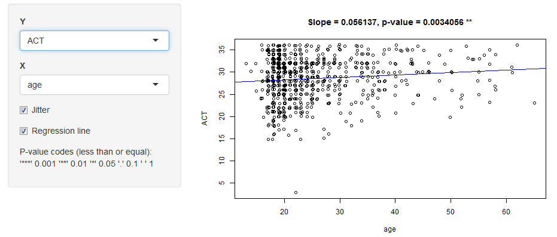

## Solution

Use the sat.act SLR Explorer!
 1. Large plots.
 1. P-values (for the slope) with significance codes.
 

---

## The sat.act dataset

 - Dataset from the [SAPA project](http://sapa-project.org) and part of the R `psych` library.
 - Contains self-reported scores on the SAT Verbal (SATV), SAT Quantitative (SATQ) and ACT tests.

Some interesting observations after using the Explorer:

 1. There might be no link between education and both SAT scores, but there might be a link between education and ACT scores.
 1. Men might have a slight advantage over women on the SATQ, but not on the SATV or ACT.

Caveat (from the `sat.act` help file): The score means are higher than national norms suggesting both self selection for people taking on line personality and ability tests and a self reporting bias in scores.

Disclaimer: The observations contained in this presentation are my own and not of my
employer. This Explorer is for exploration only and not for drawing conclusions!

---

## References

 1. Revelle, William, Wilt, Joshua, and Rosenthal, Allen (2010). [Individual Differences in Cognition: New Methods for Examining the Personality-Cognition Link.](http://dx.doi.org/10.1007/978-1-4419-1210-7_2) In Gruszka, Aleksandra, Matthews, Gerald and Szymura, Blazej (Eds.) Handbook of Individual Differences in Cognition: Attention, Memory and Executive Control, Springer.
  - Reference paper for dataset as given by the `sat.act` help file, with updated citation.

 1. Kipp, Andy (2014). [Getting started with shinyapps.io.](http://shiny.rstudio.com/articles/shinyapps.html) Accessed on 28 January 2016.
  - Contains a Diamonds Explorer that provided guidance on how to implement such applications using Shiny.

`~~~~`

This presentation was built using [Slidify](http://slidify.org/).
